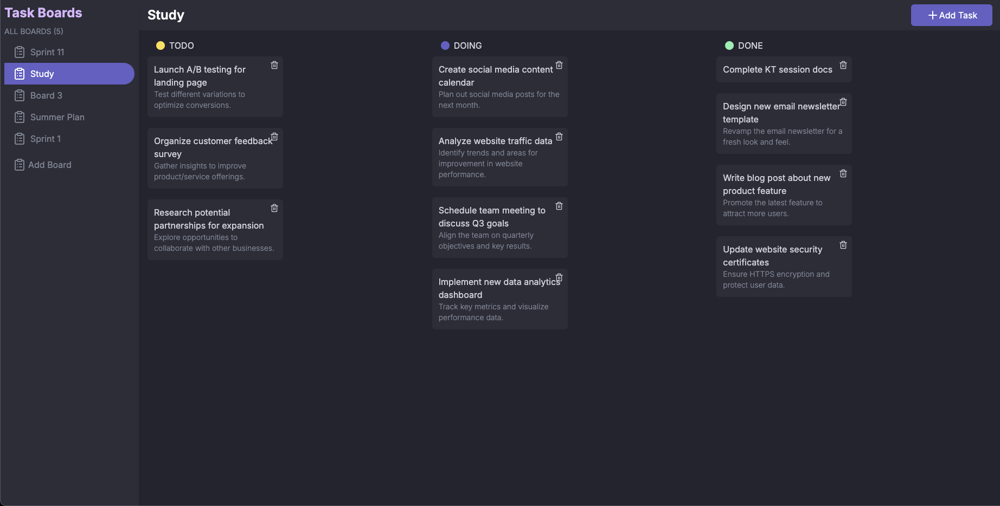
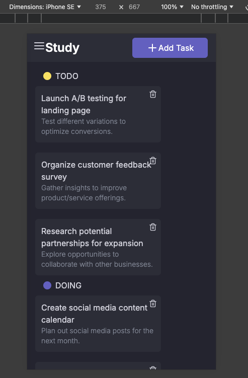

# Task Management Board

**Overview**

This project is a task management application built for managing tasks in multiple boards. It allows users to create, read, update, and delete tasks in multiple boards. The application is designed to be scalable and easily maintainable.

**Features**

* **Board Management:** Create, read, update, and delete boards.
* **Task Management:** Create, read, update, and delete tasks.
* **Responsive Design:** Support multiple screen sizes.

**Demo**





Loom Link: https://www.loom.com/share/08274fc613b64374bb33bb0e6300b529


**Tech Stack**

* **Frontend:** Next.js, TypeScript, React, Tailwind CSS
* **Backend:** Node.js, TypeScript, Express, MongoDB
* **API:** RESTful API for communication between frontend and backend

**Installation**

1. **Clone the Repository:** `git clone https://github.com/rohity123456/taskboard.git`
2. **Install Dependencies (Frontend):** `cd frontend && npm install`
3. **Install Dependencies (Backend):** `cd backend && npm install`
4. **Database Setup:**
    * Create a Mongodb database.
    * Update the database connection details in the backend environment file. Example :
    ```sh
    PORT=8000
    DB_URI=mongodb://localhost:27017/taskBoard
    ```
5. **Update Environment Variables for Frontend:** 
    ```sh
    NEXT_PUBLIC_BASE_API_URL=http://localhost:8000/api/v1
    ```

5. **Start the Application:**
    * **Frontend:** `npm run dev` (typically runs on http://localhost:3000)
    * **Backend:** `npm run dev` (typically runs on http://localhost:8000 or your chosen port)

**Project Structure**

```
taskboard/
├── frontend/          
│   ├── src/
│   │   ├── components/    
│   │   ├── app/         
│   │   ├── styles/ 
│   │   ├── store/ 
│   │   ├── lib/ 
│   │   ├── utils/
│   │   ├── package.json 
├── backend/     
│   ├── src/      
│   │   ├── controllers/   
│   │   ├── models/       
│   │   ├── routes/
│   │   ├── app.ts
│   │   ├── package.json 
├── README.md          
```

**API Endpoints**

* **Boards:**
    * `GET /api/v1/boards`: Fetch all boards
    * `POST /api/v1/boards`: Create a new board
    * `PATCH /api/v1/boards/:id`: Update a board
    * `DELETE /api/v1/boards/:id`: Delete a board
* **Tasks:**
    * `GET /api/v1/tasks`: Fetch tasks for a specific board
    * `POST /api/v1/tasks`: Create a new task in a board
    * `PATCH /api/v1/tasks/:taskId`: Update a task
    * `DELETE /api/v1/tasks/:taskId`: Delete a task

**Additional Notes**

* Error handling and validation are implemented throughout the application.
* The frontend and backend are designed to be easily scalable.
* The codebase is well-documented for readability and maintainability.
